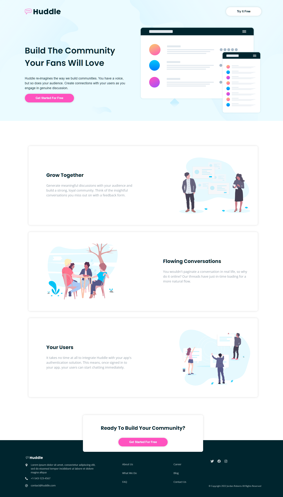

# Frontend Mentor - Huddle landing page with alternating feature blocks solution

This is a solution to the [Huddle landing page with alternating feature blocks challenge on Frontend Mentor](https://www.frontendmentor.io/challenges/huddle-landing-page-with-alternating-feature-blocks-5ca5f5981e82137ec91a5100). Frontend Mentor challenges help you improve your coding skills by building realistic projects. 

## Table of contents

- [Overview](#overview)
  - [The challenge](#the-challenge)
  - [Screenshot](#screenshot)
  - [Links](#links)
- [My process](#my-process)
  - [Built with](#built-with)
  - [What I learned](#what-i-learned)
  - [Continued development](#continued-development)
  - [Useful resources](#useful-resources)
- [Author](#author)
- [Acknowledgments](#acknowledgments)

**Note: Delete this note and update the table of contents based on what sections you keep.**

## Overview

### The challenge

Users should be able to:

- View the optimal layout for the site depending on their device's screen size
- See hover states for all interactive elements on the page

### Screenshot




### Links

- Solution URL: [https://www.frontendmentor.io/solutions/fully-responsive-landing-page-built-with-reactjs-and-styled-components-S1iyIx5Uc](https://www.frontendmentor.io/solutions/fully-responsive-landing-page-built-with-reactjs-and-styled-components-S1iyIx5Uc)
- Live Site URL: [https://huddle-jrwd.vercel.app/](https://huddle-jrwd.vercel.app/)

## My process

### Built with

- CSS custom properties
- Flexbox
- [React](https://reactjs.org/) - JS library
- [Styled Components](https://styled-components.com/) - For styles


### What I learned

This is my first time using styled components in a project. I found it really makes it easier to keep your css organized and reusable. I can see that it would be very helpful in a bigger project or with a team. I think I could have done a better job organizing and refactoring but I'm still learning how. 

I like that the app component itself is concise:

```jsx
function App() {
  return (
    <ThemeProvider theme={theme}>
      <GlobalStyles />
      <Hero />
      <Features />
      <CTA />
      <Footer />
    </ThemeProvider>
  )
}
```
I also think its super nifty that you can pinpoint an element in a certain state so easily:

```js
export const Links = styled(FlexCol)`
  padding: 20px 80px;

  @media (max-width: ${({ theme }) => theme.med}) {
    padding: 0;

    ${(props) => props.first && 'padding-top: 30px;'}
  }`
  ```


### Continued development

I plan to get more comfortable with more complicated uses of styled components and more proficient with Reactjs. 

### Useful resources

- [Styled components docs](https://styled-components.com/docs) - This was invaluable. Comprehensive and eay to understand. 
- [Brad Traversy's styled components tutorial](https://youtu.be/02zO0hZmwnw) - This was very helpful to get started. I ended up building it completely differently but this video showed me the basics.


## Author

- Jordan Roberts
- Frontend Mentor - [@FlapShatner](https://www.frontendmentor.io/profile/FlapShatner)
- GitHub - [FlapShatner](https://github.com/FlapShatner)


## Acknowledgments

Brad Traversy's video got me started and gave me the idea to do this project.
